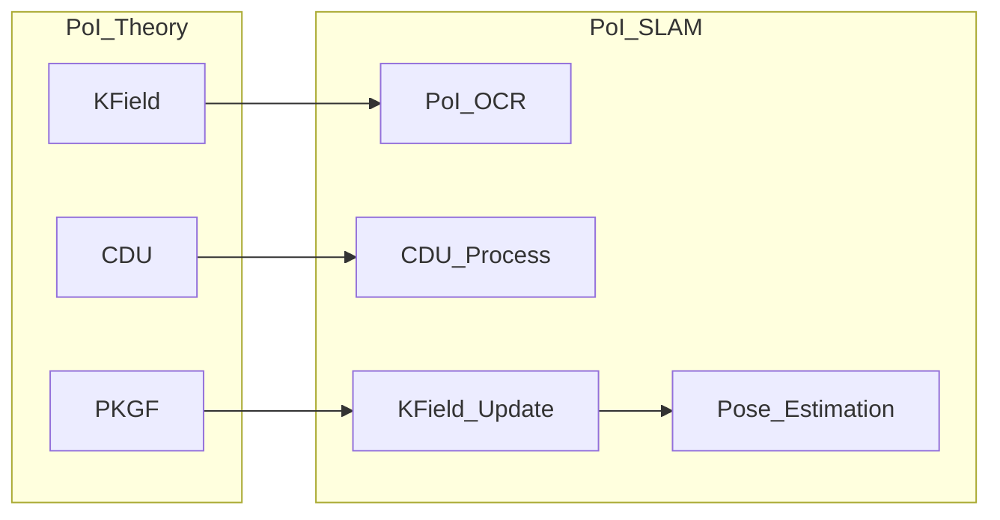
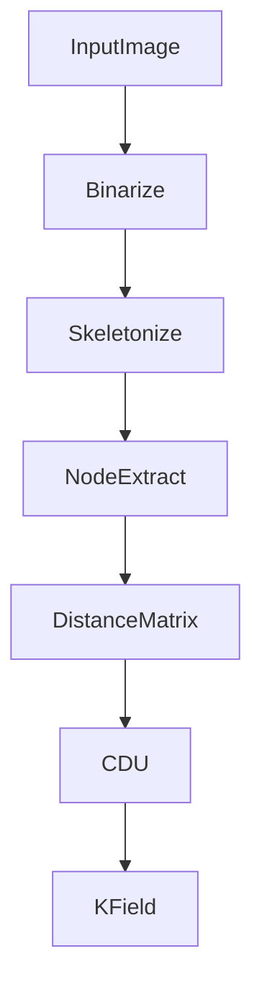
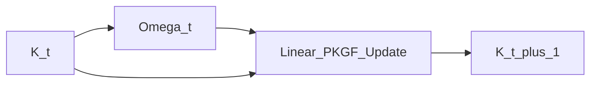

# Verifying Structural Field Physics of PoI Theory in Real-World Tasks:  
**Monocular SLAM Experiments Based on PKGF, CDU, and K-field**

**Author:** Fumio Miyata  
**Date:** April 2026  
**DOI:** [https://doi.org/10.5281/zenodo.19727137](https://doi.org/10.5281/zenodo.19727137)  
**Repository:** [https://github.com/aikenkyu001/PoI_SLAM](https://github.com/aikenkyu001/PoI_SLAM)  

---

## **Abstract**

The **Physics of Intelligence (PoI)** theory treats intelligence not as a series of computations, but as a **structural physical field (K-field)**, describing its temporal evolution through the **Parallel Key Geometric Flow (PKGF)** [1][2]. This study demonstrates that the core concepts of PoI theory—the K-field, the **Canonical Decomposition Unit (CDU)**, and the PKGF axiomatic framework—exhibit consistent physical behavior in real-world visual tasks.

We developed **PoI-SLAM (Structure-Field SLAM)** as an experimental platform that maps PoI axioms directly onto a computational system. Our approach eschews traditional feature points and descriptors entirely, performing pose estimation solely through the dynamics of structural fields. The results confirm that PoI theory serves as a **substrate-invariant** model of intelligence.

---

## **1. Introduction: The Challenge of Verifying PoI Theory**

PoI theory posits that intelligence is an emergent phenomenon of structural physics [2]. Establishing its validity requires connecting an abstract axiomatic system to real-world observational data and verifying its behavior as a physical process.

This research focuses on the empirical verification of three pillars of PoI theory:
- **K-field**: Representation of the world as a structural relationship field rather than a point cloud [2].
- **CDU**: Canonicalization of structures to ensure independence from observational arbitrariness [3].
- **PKGF**: The geometric flow governing the temporal evolution of structural fields [1].

As shown in Figure 1, PoI-SLAM serves as an experimental apparatus to transform these axioms into observable phenomena.

### **Figure 1: Mapping PoI Theory to PoI-SLAM**

---

## **2. System Pipeline**

PoI-SLAM processes visual data through a consistent flow from image binarization to structural field accumulation.

1.  **PoI-OCR (Structure Extraction)**: Binarization via Otsu's method [4] and skeletonization using the Zhang-Suen algorithm [5]. Accuracy can be further improved by Chen's (2012) [6] enhancement.
2.  **Internal Geometry ($D$)**: Building graph distances using BFS and cluster centroid augmentation, aligned with recent path-centric extraction paradigms [9].
3.  **Canonicalization (CDU)**: Stabilizing node ordering via local structural histograms and constructing the K-field.
4.  **Field Dynamics (PKGF)**: Evolving the fields based on PoI axioms [1] and performing mode analysis.
5.  **Mapping**: Accumulating structures into a voxel map with a decay factor, drawing inspiration from high-fidelity flow-guided mapping [8].

---

## **3. Mapping PoI Axioms to Computational Logic**

The implementation of PoI-SLAM corresponds directly to the axiomatic framework of PoI theory [1].

| PoI Axiom | Implementation in PoI-SLAM | Physical Concept Verified |
|---|---|---|
| **C1 (Construction Eq.)** | Linear K-field Update | Structural Inertia & Convergence |
| **D (Deconstruction)** | Voxel Decay/Attenuation | Structural Purification & Forgetting |
| **U6 (Jump of Dimension)**| Signature Change in Loop Detection | Detection of Structural Isomorphism |
| **A3 (Parallel Key K)** | K-Matrix (64-dimensional) | Existence of System State Space |

Non-linear terms in the PKGF construction equation are currently linearized for real-time performance.

---

## **4. PoI-OCR: Image Processing as Field Observation**

In PoI theory, observation is defined not as "point detection" but as **structural extraction** [3].

### **Figure 2: Structural Extraction Pipeline in PoI-OCR**

---

## **5. CDU: Invariance Against Observational Arbitrariness**

The CDU verifies the "existence of invariants" in PoI theory. Rotation invariance via PCA and ordering invariance via local signatures ensure that the extracted structure is independent of the observer's viewpoint.

---

## **6. PKGF: Temporal Evolution of Structural Fields**

The core of PoI theory is the temporal evolution of fields governed by the Parallel Key Geometric Flow (PKGF) [1].

### **Figure 3: K-field Update via Linearized PKGF**

---

## **7. Experimental Results and Discussion**

### **7.1 Verification of Stages 1–4**
- **Distance Test** → Validates the decay logic and linearization of C1.
- **Rotation Test** → Confirms the integrity of invariants maintained by the CDU.
- **Topology Change Test** → Demonstrates detection of structural shifts via U6 signatures.
- **Real-world Synthesis** → Proves **substrate-invariance** by showing identical dynamics across Native and Web environments.

### **7.2 Comparison with Conventional SLAM**
Unlike systems like ORB-SLAM [7] that rely on feature matching, PoI-SLAM performs pose estimation using **only the physical quantities of the structural field**. This approach shares computational efficiency goals with recent acceleration techniques [10].

---

## **8. Limitations and Future Directions**

1. **Extraction Sensitivity**: Potential instability of node extraction in textureless environments.
2. **Scale Ambiguity**: Monocular constraints requiring external references.
3. **Non-linear Terms**: Analyzing the contribution of higher-order PKGF terms during extreme motion.

---

## **9. Conclusion**

This study empirically demonstrates that the core pillars of PoI theory exhibit **consistent physical behavior** in real-world visual tasks. We confirmed that PoI theory functions as a **substrate-invariant model of intelligence**.

---

## **10. Demonstration and Reproducibility**

Official online demonstration: [https://itb.co.jp/slam/](https://itb.co.jp/slam/)  
(In case of downtime, local reproduction is possible via the `Web/` directory using `python3 -m http.server`.)

---

## **References**

### **Foundational PoI Theory (By Fumio Miyata)**
[1] F. Miyata, *Axiomatic Framework of Parallel Key Geometric Flow (PKGF)*, 2026. DOI: 10.5281/zenodo.19481201.  
[2] F. Miyata, *Physics of Intelligence: Substrate-Invariant Formalism and Verification of PKGF*, 2026. DOI: 10.5281/zenodo.19659376.  
[3] F. Miyata, *PoI-OCR: Geometric Character Recognition Based on Physical Resonance*, 2026. DOI: 10.5281/zenodo.19689520.  

### **External Algorithms and Baselines**
[4] N. Otsu, "A Threshold Selection Method from Gray-Level Histograms," *IEEE Trans. SMC*, 1979.  
[5] T. Y. Zhang and C. Y. Suen, "A fast parallel algorithm for thinning digital patterns," *CACM*, 1984.  
[6] Y. Chen and W. Wang, "An improved Zhang-Suen thinning algorithm," *J. Computer Applications*, 2012.  
[7] R. Mur-Artal et al., "ORB-SLAM," *IEEE Trans. Robotics*, 2015.  
[8] D. Seo et al., "GaussianFlow SLAM," *RA-L*, 2026. (arXiv:2604.15612)  
[9] W. Guan et al., "Beyond Endpoints: Path-Centric Reasoning," *arXiv:2512.10416*, 2026.  
[10] X. Xiong et al., "Geometric Utility Scoring," *arXiv:2604.08718*, 2026.
