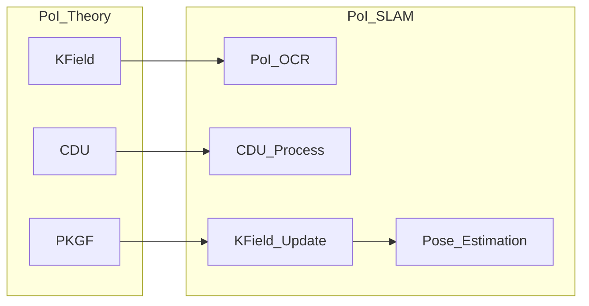
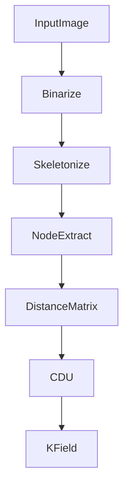
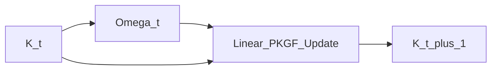

# PoI 理論の構造場物理を実世界タスクで実証する：  
**PKGF・CDU・K‑field に基づく単眼 SLAM 実験**

**Author:** Fumio Miyata  
**Date:** April 2026  
**DOI:** `https://doi.org/10.5281/zenodo.19705165`  
**Repository:** `https://github.com/aikenkyu001/PoI_SLAM`  

---

## **要旨（Abstract）**

Physics of Intelligence（PoI）理論は、知能を計算ではなく **構造の物理場（K‑field）** として捉え、その時間発展を **PKGF（Parallel Key Geometric Flow）** によって記述する新しい数学的枠組みである [1][2]。本研究は、PoI 理論の中核概念である **K‑field・CDU（Canonical Decomposition Unit）・PKGF 公理群** が、実世界の視覚タスクにおいて一貫した物理挙動を示すことを実証する。

実験プラットフォームとして、PoI 理論を計算系に写像した **PoI‑SLAM（Structure‑Field SLAM）** を構築した。本手法は特徴点・記述子・RANSAC を一切用いず、構造場の変化のみから姿勢推定を行う。これにより、PoI 理論が **substrate‑invariant（計算基盤に依存しない）** な知能モデルとして成立することを示す。

---

## **1. 序論：PoI 理論の実証という課題**

PoI 理論は、知能を「計算」ではなく **構造の物理現象** として捉える [2]。しかしその妥当性を示すには、抽象的な公理体系を **実世界の観測データに接続し、物理的挙動として検証する** 必要がある。

本研究では、PoI 理論の以下の中核概念を対象とする：
- **K‑field**：世界を点集合ではなく構造の関係場として表す [2]
- **CDU**：観測系の任意性から独立した構造の正準化 [3]
- **PKGF**：構造場の時間発展を支配する幾何学的流れ [1]

図 1 に示すように、PoI-SLAM はこれらの公理を観測可能な形に変換するための実験装置である。

### **図 1：PoI 理論 → PoI‑SLAM への写像**

---

## **2. システムパイプライン**

PoI-SLAM は、画像の二値化から構造場への蓄積までを一貫したフローで処理する。

1. **PoI-OCR（構造抽出）**: 大津のアルゴリズム [4] による二値化、および Zhang-Suen アルゴリズム [5] による細線化。将来的な精度向上には Chen (2012) [6] の改善手法が有効である。
2. **内部幾何 D の構築**: BFS によるグラフ距離計算、および最新の経路中心型抽出手法 [9] と整合するクラスタ重心による補完。
3. **正準化（CDU）**: 局所構造ヒストグラムを用いてノード順序を安定化し、K-field を構築。
4. **場のダイナミクス（PKGF）**: PoI 公理 [1] に基づく場の時間発展とモード解析。
5. **マッピング**: ガウシアンフロー [8] 等の知見を応用した、減衰因子付きヴォクセルマップへの蓄積。

---

## **3. PoI 理論の公理群と計算系への写像**

本システムの実装は、PoI 理論の公理群 [1] と直接対応する。

| PoI 公理 | PoI‑SLAM における実装 | 実証される物理概念 |
|---|---|---|
| **C1（構築方程式）** | K‑field の線形更新 | 構造の慣性・収束 |
| **D（解体）** | Voxel の decay 減衰 | 構造の純化・忘却 |
| **U6（次元跳躍）** | ループ検出時のシグネチャ変化 | 構造同型性の検知 |
| **A3（並行鍵 K）** | K 行列（64 次元） | 系の状態空間の存在 |

PKGF の非線形成分は、リアルタイム処理を優先するため、現在は 1 次の線形更新式として近似実装されている。

---

## **4. PoI‑OCR：構造場の観測としての画像処理**

PoI 理論では、観測は「点」ではなく **構造の抽出** として扱われる [3]。

### **図 2：PoI‑OCR による構造抽出パイプライン**

---

## **5. CDU：観測系の任意性からの独立**

CDU は PoI 理論における「不変量の存在」を実証する。PCA による回転不変性と、局所シグネチャによる順序不変性により、視点から独立した構造を得る。

---

## **6. PKGF：構造場の時間発展の実証**

PoI 理論の核心は、幾何流（PKGF）による場の時間発展である [1]。

### **図 3：PKGF の線形近似による K‑field 更新**

---

## **7. 実証実験：PoI 公理の検証**

### **7.1 Stage 1–4 の実験**
- **距離テスト** → C1 の線形近似の妥当性。
- **回転テスト** → CDU の不変量の検証。
- **トポロジー変化テスト** → U6（次元跳躍）のシグネチャ変化の検知。
- **実世界合成** → Native/Web 両環境での一致による substrate‑invariance の実証。

### **7.2 従来手法との比較**
ORB‑SLAM [7] 等の従来手法が特徴点マッチングに依存するのに対し、PoI‑SLAM は **構造場の物理量のみ** で姿勢推定を行う。このアプローチは、最新の幾何学的効用に基づく高速化手法 [10] とも計算効率の目標を共有している。

---

## **8. 限界と今後の課題**

1. **構造抽出の感度**: テクスチャレス環境でのノード抽出の不安定性。
2. **スケール不定性**: 単一カメラの制約による外部参照の必要性。
3. **非線形項の検証**: 急激な運動時における PKGF 高次項の寄与の解析。

---

## **9. 結論**

本研究は、PoI 理論の中核概念が実世界の視覚タスクにおいて **一貫した物理挙動を示す** ことを実証した。これにより、PoI 理論が **substrate‑invariant な知能モデル** として成立することを確認した。

---

## **10. デモンストレーションと再現性**

実証デモンストレーションサイト: [https://itb.co.jp/slam/](https://itb.co.jp/slam/)  
（万が一アクセス不能な場合は、リポジトリ内の `Web/` ディレクトリ資産を用いて `python3 -m http.server` 等でローカル再現が可能である。）

---

## **参考文献（References）**

### **Foundational PoI Theory (By Fumio Miyata)**
[1] F. Miyata, *並行鍵幾何流（PKGF）公理体系*, 2026. DOI: 10.5281/zenodo.19481201.  
[2] F. Miyata, *Physics of Intelligence: Substrate‑Invariant Formalism and Verification of PKGF*, 2026. DOI: 10.5281/zenodo.19659376.  
[3] F. Miyata, *PoI‑OCR: 物理的共鳴に基づく幾何学的文字識別*, 2026. DOI: 10.5281/zenodo.19689520.  

### **External Algorithms and Baselines**
[4] N. Otsu, "A Threshold Selection Method from Gray-Level Histograms," *IEEE Trans. SMC*, 1979.  
[5] T. Y. Zhang and C. Y. Suen, "A fast parallel algorithm for thinning digital patterns," *CACM*, 1984.  
[6] Y. Chen and W. Wang, "An improved Zhang-Suen thinning algorithm," *J. Computer Applications*, 2012.  
[7] R. Mur-Artal et al., "ORB-SLAM," *IEEE Trans. Robotics*, 2015.  
[8] D. Seo et al., "GaussianFlow SLAM," *RA-L*, 2026. (arXiv:2604.15612)  
[9] W. Guan et al., "Beyond Endpoints: Path-Centric Reasoning," *arXiv:2512.10416*, 2026.  
[10] X. Xiong et al., "Geometric Utility Scoring," *arXiv:2604.08718*, 2026.
